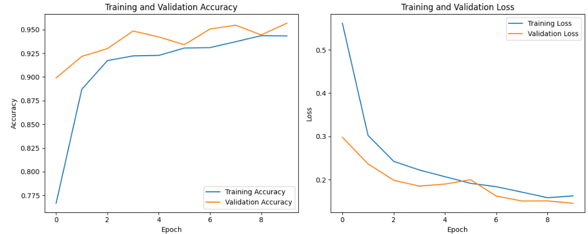
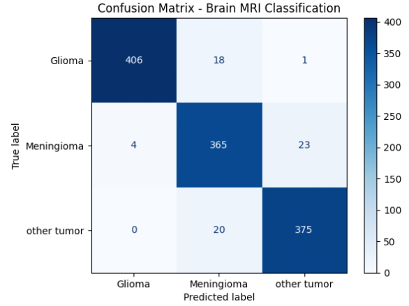
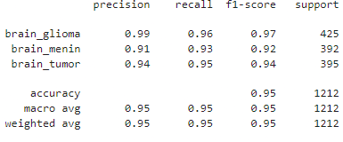

# Brain MRI Tumor Classification Using MobileNetV2

A deep learning project for classifying brain MRI images into three tumor categories using Transfer Learning and MobileNetV2.

## Overview

This project applies a convolutional neural network based on MobileNetV2 to classify brain MRI images into three classes:

- Glioma
- Meningioma
- Other Tumor

The goal of this project is to demonstrate the use of Transfer Learning for medical image classification in an educational and research context.

## Dataset

The dataset contains brain MRI images organized into three categories:

1. Glioma
2. Meningioma
3. Other Tumor

Images were resized to 224 × 224 pixels before being processed by the model.

The dataset was divided into training and testing subsets using an 80/20 split. During training, 10% of the training data was used for validation.

## Technologies Used

- Python
- TensorFlow
- Keras
- NumPy
- Pandas
- Matplotlib
- Scikit-learn
- Pillow

## Model Architecture

This project uses MobileNetV2 as a pretrained feature extractor.

The original ImageNet classification head was removed using:

```python
include_top=False
## Custom Classification Head

After removing the original ImageNet classification layer, a custom classification head was added for three-class brain tumor classification.

The architecture includes:

- GlobalAveragePooling2D
- Dropout with a rate of 0.3
- Dense layer with Softmax activation

## Training Configuration

| Parameter | Value |
|---|---|
| Image Size | 224 × 224 |
| Batch Size | 32 |
| Epochs | 10 |
| Number of Classes | 3 |
| Optimizer | Adam |
| Loss Function | Categorical Crossentropy |

## Results

### Test Accuracy

94.55%

### Classification Report

| Class | Precision | Recall | F1-Score |
|---|---:|---:|---:|
| Glioma | 99% | 95% | 97% |
| Meningioma | 93% | 91% | 92% |
| Other Tumor | 93% | 98% | 95% |

The model achieved relatively balanced performance across the three classes.

Glioma achieved the highest F1-Score, while Meningioma showed slightly lower recall compared with the other classes.

## Confusion Matrix

The confusion matrix evaluates the performance of the model across the three tumor categories.

Most predictions were correctly classified along the diagonal of the matrix.

The main classification errors occurred between Meningioma and Other Tumor.

## Training Analysis

The training curves show that the model gradually improved during training.

Both training and validation accuracy increased, while training and validation loss generally decreased.

The relatively small gap between training and validation performance suggests that the model did not show severe overfitting during the 10 training epochs.

## Future Improvements

- Fine-tuning the MobileNetV2 base model
- Data augmentation
- Comparing with other CNN architectures
- Improving model generalization

## Project Results

### Training History



### Confusion Matrix



### Classification Report



## Disclaimer

This project is for educational and research purposes only and is not intended for medical diagnosis.

## Author

Sama Yousefy
